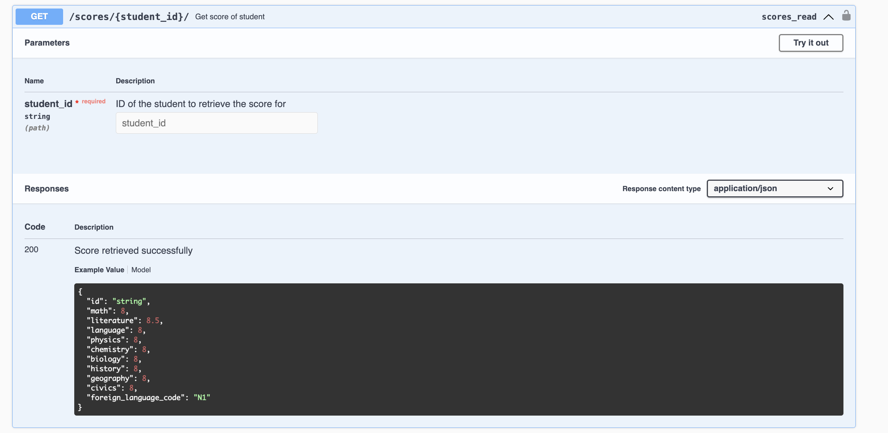
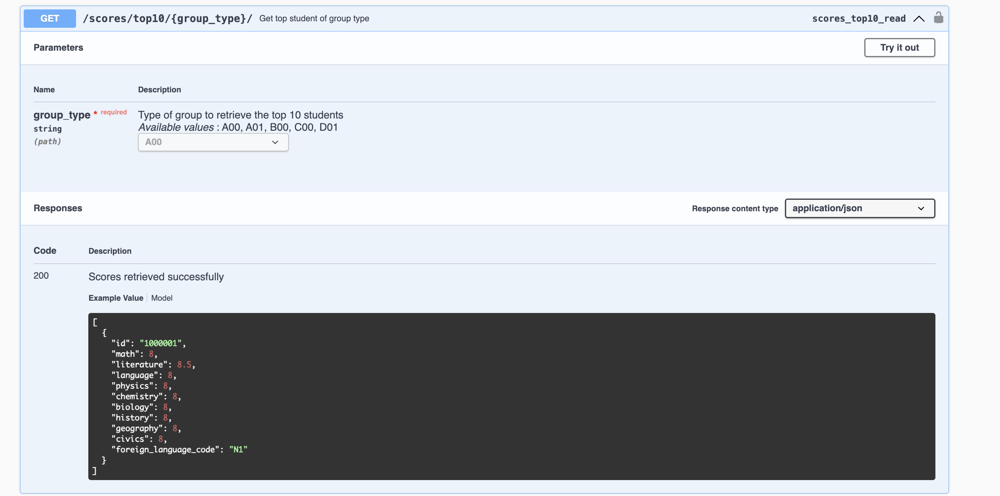
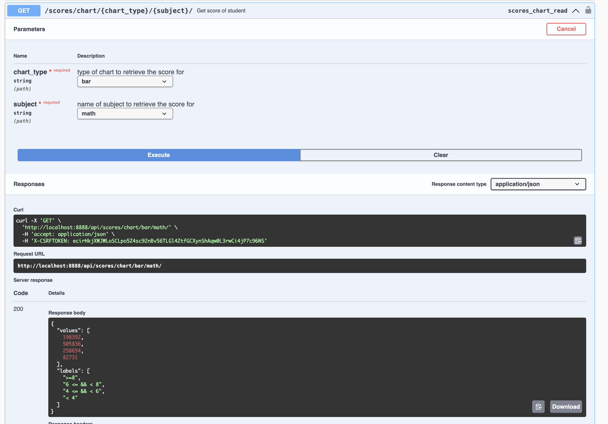

# Technical

- **Application**: [Django](https://www.djangoproject.com/)
- **Seed data**: [Python](https://www.python.org/)

# Settings

- **python**: [Python](https://www.python.org/)
- **docker**: [python.org](https://www.docker.com/products/docker-desktop/)
- **makefile**
  - _Window_: Using [Chocolatey](https://chocolatey.org/install) (Ref: [StackOverFlow](https://stackoverflow.com/questions/32127524/how-to-install-and-use-make-in-windows))
  - _MacOS_: using Brew `brew install make`
  - _Linux_: using apt `sudo apt install build-essential -y`

# Overview architecture

- Since top students group data or chart data is frequently used, caching will be utilized to improve application performance.

# Run

## Development enviroment

- First, create Redis and PostgreSQL (I chose PostgreSQL because it is strong for selecting data).
  `docker compose up -d` hoặc `make container-up`
- You can create a **Python virtual environment** if you don’t want to
  install packages directly on your machine.

  `python3 -m venv .venv`

  `source .venv/bin/activate`

  `pip3 install -r requirements.txt` hoặc `make install`

- For migrate run `python3 manage.py migrate` hoặc `make migrate`

- For run `python3 manage.py runserver` hoặc `make up`

- Run seed.py

  `python3 src/database/seeds/seed.py`

  - Note\*: Change db_url to database path

# Build

- Use multi-stage builds in Dockerfile to reduce the image size.
- Build Docker Image
  `make build`
- Push Image to Docker Hub
  `make push`

# Deploy

**Backend**

- Using [Onrender](https://render.com/) (Docker image - docker.io/vuong676/gscore:latest)
- Link Deployed: https://gscore-backend.onrender.com/swagger

**Database**: Using [Aiven Console](https://console.aiven.io/) (Since support free 5GB).

# Swagger API

- Check Scores Feature

- Get Top Student By Group Type Feature
  

- Retrieve subject score information for bar chart or circle chart.

